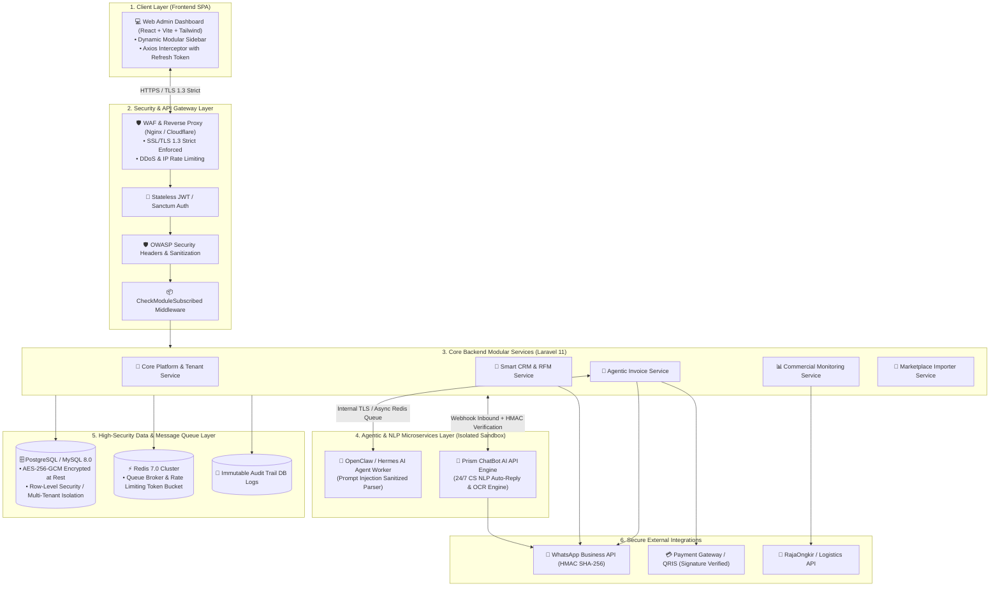
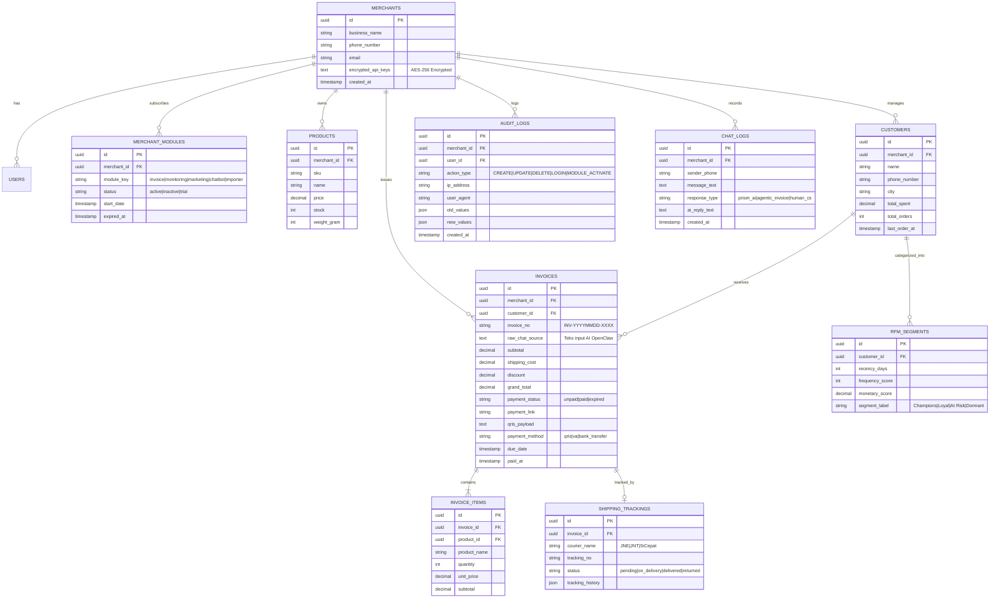

# TECHNICAL ARCHITECTURE BLUEPRINT
## Moobi Retail — Modular Agentic CRM & Commerce Enabler Ecosystem

**Version:** 2.0.0 (Enterprise Security & Cloud-Agnostic Edition)  
**Target Platform:** Cloud-Agnostic Infrastructure (Railway for Testing/Staging; AWS/GCP/DigitalOcean/Self-Hosted VPS for Production)  
**Target Team:** 7 Developers (3 Backend, 4 Frontend) using Antigravity AI Coding Assistant  
**Compliance Standards:** OWASP Top 10 (2025/2026), ISO/IEC 27001, RESTful API Standard Specification (JSend)

---

# 1. System Topology & Architecture Overview

Sistem Moobi Retail dibangun menggunakan pendekatan **Modular Monolith Backend (Laravel 11 REST API)** yang dipasangkan dengan **Microservices AI Workers (OpenClaw / Hermes & Prism ChatBot API)** serta **Modern Single Page Application Frontend (React.js + Vite + Tailwind CSS + Shadcn UI)**. 

Arsitektur dirancang bersifat **Cloud-Agnostic / Containerized (Docker-Ready)**, sehingga dapat dijalankan di lingkungan pengujian cepat (**Railway Cloud**) maupun lingkungan produksi berkinerja tinggi (**AWS ECS / Google Cloud Run / DigitalOcean / Dedicated Bare-Metal VPS**) tanpa perubahan kode.



---

# 2. Directory & File Structure Blueprint

### 2.1 Backend Structure (`moobi-backend/` - Laravel 11 Modular Clean Architecture)

```text
moobi-backend/
├── app/
│   ├── Http/
│   │   ├── Controllers/
│   │   │   ├── AuthController.php
│   │   │   └── MerchantController.php
│   │   └── Middleware/
│   │       ├── Authenticate.php
│   │       ├── CheckModuleSubscribed.php        # Validasi lisensi modul à la carte
│   │       ├── SecurityHeadersMiddleware.php    # HSTS, CSP, X-Frame-Options
│   │       ├── RateLimitRequests.php           # Throttling perlindungan brute force
│   │       └── VerifyWebhookSignature.php       # HMAC SHA-256 Signature Verification
│   ├── Models/
│   │   ├── Merchant.php
│   │   ├── MerchantModule.php                  # Tracking lisensi modul à la carte
│   │   ├── User.php
│   │   ├── Customer.php
│   │   ├── Invoice.php
│   │   ├── InvoiceItem.php
│   │   ├── Product.php
│   │   ├── RfmSegment.php
│   │   ├── ShippingTracking.php
│   │   ├── ChatLog.php
│   │   └── AuditLog.php                        # Immutable audit trail
│   ├── Modules/                                # Arsitektur Modular Independen
│   │   ├── AgenticInvoice/
│   │   │   ├── Controllers/AgenticInvoiceController.php
│   │   │   ├── Services/OpenClawParserService.php
│   │   │   ├── Services/PromptSanitizationService.php # Sanitasi Prompt Injection
│   │   │   ├── Services/QrisGeneratorService.php
│   │   │   └── Jobs/SendInvoiceWhatsAppReminderJob.php
│   │   ├── Monitoring/
│   │   │   ├── Controllers/MonitoringController.php
│   │   │   └── Services/AnalyticsAggregationService.php
│   │   ├── MarketingCRM/
│   │   │   ├── Controllers/MarketingCrmController.php
│   │   │   ├── Services/RfmCalculationEngine.php
│   │   │   └── Jobs/DispatchWhatsAppBroadcastJob.php
│   │   ├── ChatbotAI/
│   │   │   ├── Controllers/PrismChatBotController.php
│   │   │   └── Services/PrismApiService.php
│   │   └── MarketplaceImporter/
│   │       ├── Controllers/ImporterController.php
│   │       └── Services/ShopeeTokopediaCsvParser.php
│   └── Providers/
│       └── ModuleServiceProvider.php
├── database/
│   ├── migrations/                             # Migrasi DDL lengkap + Indexes
│   └── seeders/
│       ├── DatabaseSeeder.php
│       └── DummyCrmPrototypeSeeder.php         # Seeder data prototype dummy
├── routes/
│   ├── api.php
│   └── webhooks.php                            # Webhook WhatsApp & Payment Gateway (Protected)
├── docker/
│   ├── nginx.conf
│   └── php.ini
├── Dockerfile                                  # Multi-stage production build
├── docker-compose.yml                          # Standar Docker untuk VPS/AWS/Local
└── railway.json                                # Skrip deploy cepat untuk pengujian/testing
```

### 2.2 Frontend Structure (`moobi-frontend/` - React + Vite + Tailwind)

```text
moobi-frontend/
├── src/
│   ├── api/
│   │   ├── axiosClient.js                      # Axios interceptor (JWT auto-refresh & sanitization)
│   │   ├── authApi.js
│   │   ├── invoiceApi.js
│   │   ├── monitoringApi.js
│   │   ├── marketingApi.js
│   │   └── chatbotApi.js
│   ├── components/
│   │   ├── layout/
│   │   │   ├── AppLayout.jsx
│   │   │   ├── DynamicSidebar.jsx              # Sidebar yang otomatis sembunyikan modul non-aktif
│   │   │   ├── Navbar.jsx
│   │   │   └── ModuleLockedModal.jsx           # Modal popup jika klik modul yang belum dibeli
│   │   ├── ui/                                 # Shadcn UI primitives (Button, Modal, Toast, dll)
│   │   └── common/
│   │       ├── StatCard.jsx
│   │       └── DataTable.jsx
│   ├── pages/
│   │   ├── auth/
│   │   │   ├── Login.jsx
│   │   │   └── Register.jsx
│   │   ├── dashboard/
│   │   │   └── OverviewDashboard.jsx
│   │   ├── modules/
│   │   │   ├── ModuleMarketplace.jsx           # Tempat merchant beli modul à la carte
│   │   │   ├── invoice/
│   │   │   │   ├── InvoiceList.jsx
│   │   │   │   ├── CreateAgenticInvoice.jsx    # Playground AI Chat-to-Invoice
│   │   │   │   └── InvoiceDetail.jsx
│   │   │   ├── monitoring/
│   │   │   │   ├── RevenueMonitoring.jsx
│   │   │   │   ├── CsPerformance.jsx
│   │   │   │   └── ShippingTracking.jsx
│   │   │   ├── marketing/
│   │   │   │   ├── CustomerList.jsx
│   │   │   │   ├── RfmSegmentation.jsx
│   │   │   │   └── WhatsAppBroadcast.jsx
│   │   │   ├── chatbot/
│   │   │   │   ├── ChatbotLiveSimulator.jsx    # Simulator chat CS 24/7 (Prism Engine)
│   │   │   │   └── ChatbotFaqSettings.jsx
│   │   │   └── importer/
│   │   │       └── MarketplaceImport.jsx
│   ├── context/
│   │   ├── AuthContext.jsx
│   │   └── ModuleLicenseContext.jsx            # State global daftar modul aktif
│   ├── App.jsx
│   └── main.jsx
├── Dockerfile
└── package.json
```

---

# 3. Database Schema & ERD Blueprint



---

# 4. REST API Contract & Specifications

### 4.1 Modul 1: Agentic Invoice (OpenClaw / Hermes Integration)

#### Endpoint 1: Parse Raw Chat to Invoice Proposal
- **POST** `/api/v1/invoices/agentic-parse`
- **Headers:** `Authorization: Bearer <TOKEN>`, `X-Merchant-ID: <UUID>`
- **Request Body:**
```json
{
  "raw_chat": "Halo kak, saya mau pesan Kemeja Hitam Size L 2 pcs dan Kaos Polos Putih 1 pcs. Kirim ke Jl. Tidar No 12 Malang, atas nama Budi Santoso (081234567890) pakai JNE ya kak."
}
```
- **Response (200 OK):**
```json
{
  "status": "success",
  "data": {
    "customer": {
      "name": "Budi Santoso",
      "phone": "081234567890",
      "address": "Jl. Tidar No 12 Malang",
      "city": "Malang"
    },
    "courier_requested": "JNE",
    "items": [
      {
        "product_id": "f81d4fae-7dec-11d0-a765-00a0c91e6bf6",
        "name": "Kemeja Hitam Size L",
        "qty": 2,
        "price": 125000,
        "subtotal": 250000
      },
      {
        "product_id": "f81d4fae-7dec-11d0-a765-00a0c91e6bf7",
        "name": "Kaos Polos Putih",
        "qty": 1,
        "price": 50000,
        "subtotal": 50000
      }
    ],
    "subtotal": 300000,
    "estimated_shipping_cost": 15000,
    "grand_total": 315000,
    "confidence_score": 0.96
  }
}
```

#### Endpoint 2: Confirm & Publish Agentic Invoice (Generate QRIS & Send WA)
- **POST** `/api/v1/invoices/publish`
- **Request Body:**
```json
{
  "customer_name": "Budi Santoso",
  "customer_phone": "081234567890",
  "shipping_address": "Jl. Tidar No 12 Malang",
  "items": [
    {"product_id": "f81d4fae-7dec-11d0-a765-00a0c91e6bf6", "qty": 2, "price": 125000},
    {"product_id": "f81d4fae-7dec-11d0-a765-00a0c91e6bf7", "qty": 1, "price": 50000}
  ],
  "shipping_cost": 15000,
  "discount": 0,
  "auto_send_wa": true
}
```
- **Response (201 Created):**
```json
{
  "status": "success",
  "message": "Invoice created and sent to WhatsApp",
  "data": {
    "invoice_id": "a9b1c2d3-e4f5-4a6b-8c7d-9e0f1a2b3c4d",
    "invoice_no": "INV-20260911-0089",
    "grand_total": 315000,
    "payment_status": "unpaid",
    "payment_url": "https://pay.moobi.id/inv/INV-20260911-0089",
    "qris_image_url": "https://api.moobi.id/qris/INV-20260911-0089.png",
    "wa_dispatch_status": "sent"
  }
}
```

---

### 4.2 Modul 2: Monitoring API Endpoints
- **GET** `/api/v1/monitoring/overview-kpi` $\rightarrow$ Return Omzet hari ini, invoice paid vs unpaid, closing rate CS.
- **GET** `/api/v1/monitoring/shipping-tracking` $\rightarrow$ Return status live resi paket aktif kurir JNE/J&T/SiCepat.

---

### 4.3 Modul 3: Marketing CRM & RFM Segmentation Endpoints
- **GET** `/api/v1/marketing/rfm-analysis` $\rightarrow$ Return summary segmentasi: *Champions, Loyal, At Risk, Dormant*.
- **POST** `/api/v1/marketing/whatsapp-broadcast` $\rightarrow$ Trigger blast pesan promo ke segmen tertentu.

---

### 4.4 Modul 4: Chatbot AI CS API (Prism Engine)
- **POST** `/api/v1/chatbot/simulate-message`
- **Request:** `{"message": "Halo kak, cek ongkir ke Surabaya dan baju hitam ready gak?"}`
- **Response:** `{"reply": "Halo Kak! Untuk pengiriman ke Surabaya estimasi Rp 12.000 (JNE). Kemeja hitam saat ini ready stok 5 pcs ya kak. Mau kami buatkan invoice langsung?"}`

---

# 5. Middleware & Modular License Protection

Untuk mendukung model bisnis **À la Carte (Beli Per Modul)**, backend Laravel wajib mengimplementasikan middleware khusus:

```php
namespace App\Http\Middleware;

use Closure;
use Illuminate\Http\Request;

class CheckModuleSubscribed
{
    public function handle(Request $request, Closure $next, string $moduleKey)
    {
        $merchant = $request->user()->merchant;

        $hasModule = $merchant->modules()
            ->where('module_key', $moduleKey)
            ->where('status', 'active')
            ->where('expired_at', '>', now())
            ->exists();

        if (!$hasModule) {
            return response()->json([
                'status' => 'forbidden',
                'error_code' => 'MODULE_NOT_SUBSCRIBED',
                'message' => "Modul '{$moduleKey}' belum aktif pada akun Anda. Silakan berlangganan di Marketplace Modul.",
                'upgrade_url' => "/marketplace-modules/{$moduleKey}"
            ], 403);
        }

        return $next($request);
    }
}
```

---

# 6. Enterprise Security & OWASP Hardening Specifications

Untuk memenuhi standar keamanan industri tertinggi (OWASP Top 10 & ISO 27001), sistem wajib menerapkan 5 lapisan proteksi berikut:

### 6.1 HMAC SHA-256 Webhook Verification
Seluruh webhook inbound (WhatsApp Gateway & Payment Gateway) wajib diverifikasi menggunakan signature rahasia sebelum data diproses untuk mencegah serangan manipulasi/spoofing:

```php
namespace App\Http\Middleware;

use Closure;
use Illuminate\Http\Request;

class VerifyWebhookSignature
{
    public function handle(Request $request, Closure $next, string $gatewayType)
    {
        $signature = $request->header('X-Hub-Signature-256') ?? $request->header('X-Signature');
        $secret = config("services.{$gatewayType}.webhook_secret");
        $computed = hash_hmac('sha256', $request->getContent(), $secret);

        if (!hash_equals($computed, (string)$signature)) {
            \Log::warning("Unauthorized Webhook attempt from IP: " . $request->ip());
            return response()->json(['error' => 'Invalid Webhook Signature'], 401);
        }

        return $next($request);
    }
}
```

### 6.2 Prompt Injection Guardrails (AI Agent Security)
Karena AI Agent (*OpenClaw / Hermes*) memproses teks bebas dari chat pembeli luar yang tidak terautentikasi, teks wajib disanitasi sebelum dikirimkan ke model AI:
1. **System Prompt Delimiter Separation**: Memisahkan instruksi sistem dengan data pengguna menggunakan format block XML tag yang ketat (`<user_order_text>...</user_order_text>`).
2. **Blacklist Injection Regex**: Memfilter upaya prompt injection seperti *"Ignore previous instructions"*, *"System prompt reveal"*, atau *"DROP TABLE"*.
3. **Strict JSON Schema Output Enforcement**: Output AI wajib divalidasi dengan `JSON Schema Validator` sebelum diterima oleh controller Laravel.

### 6.3 Encryption at Rest & Secret Storage (AES-256-GCM)
- Seluruh kunci API pihak ketiga (WhatsApp API Token, Midtrans Server Key) yang disimpan di tabel `merchants` wajib dienkripsi menggunakan algoritma **AES-256-GCM** via Laravel Eloquent Cast:
```php
protected $casts = [
    'encrypted_api_keys' => 'encrypted:array',
];
```

### 6.4 API Rate Limiting & Throttling
Mencegah serangan brute force dan denial-of-service (DoS) menggunakan Redis Token Bucket:
- **Auth Endpoints (Login/Register)**: Maksimal 5 percobaan per menit per IP.
- **AI Parsing & Chatbot Endpoints**: Maksimal 30 request per menit per merchant.
- **Public Query Endpoints**: Maksimal 60 request per menit.

### 6.5 Immutable Security Audit Trail
Setiap perubahan kritis (perubahan harga produk, penerbitan invoice manual, aktivasi modul, dan penghapusan data) otomatis tercatat ke tabel `audit_logs` dengan sifat **Append-Only** (tidak ada endpoint untuk update/delete baris log).

---

# 7. Deployment Strategy: Testing vs Production (Cloud-Agnostic)

Arsitektur aplikasi dirancang modular dan berbasis kontainer (**Docker-First**) agar fleksibel dijalankan di platform mana saja:

| Lingkungan | Platform yang Digunakan | Karakteristik & Alasan Pemilihan |
| :--- | :--- | :--- |
| **Testing / Staging Sandbox** | **Railway Cloud Platform** | • Sangat cepat untuk deploy prototipe dan integrasi branch GitHub.<br>• Managed Redis & PostgreSQL instan.<br>• Cocok untuk validasi atasan dan demonstrasi fitur. |
| **Production Environment** | **AWS ECS / GCP Cloud Run / DigitalOcean K8s / Bare-Metal VPS** | • Skalabilitas tinggi (*Horizontal Pod Autoscaler*).<br>• Keamanan jaringan VPC terisolasi & Database Multi-AZ.<br>• Efisiensi biaya jangka panjang saat menampung ribuan transaksi per detik. |

### Docker Compose Multi-Service Blueprint (Universal Deployment):
```yaml
version: '3.8'
services:
  moobi-backend:
    build:
      context: ./moobi-backend
      dockerfile: Dockerfile
    restart: always
    environment:
      - APP_ENV=production
      - DB_CONNECTION=pgsql
      - REDIS_HOST=moobi-redis
    depends_on:
      - moobi-db
      - moobi-redis

  moobi-frontend:
    build:
      context: ./moobi-frontend
      dockerfile: Dockerfile
    ports:
      - "80:80"
    depends_on:
      - moobi-backend

  moobi-ai-worker:
    build:
      context: ./moobi-ai-worker
      dockerfile: Dockerfile
    environment:
      - REDIS_URL=redis://moobi-redis:6379

  moobi-db:
    image: postgres:16-alpine
    restart: always
    volumes:
      - pgdata:/var/lib/postgresql/data

  moobi-redis:
    image: redis:7-alpine
    restart: always

volumes:
  pgdata:
```
