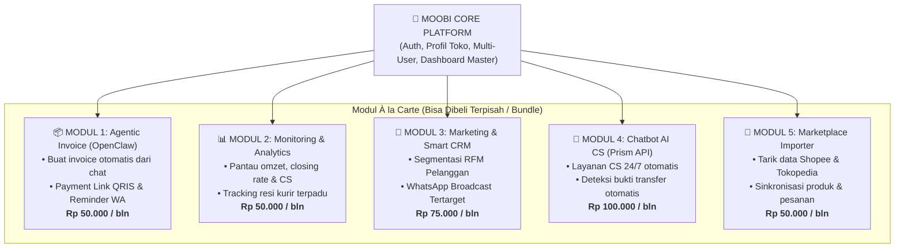

# PT ABSYSTEM TECHNOLOGY SOLUTION
## BUSINESS REQUIREMENTS DOCUMENT (BRD)
### Moobi Retail — Modular Agentic CRM & Commerce Enabler Ecosystem
**No. Dok.:** MBI-PRD-BRD-2026-003 | **No. Rev.:** 01 | **Tanggal:** 11 September 2026 | **Effective Date:** 11 September 2026 | **Hal./Page:** 1 of 9

---

## 1. Document Revisions

| Date | Version | Document Changes |
| :--- | :--- | :--- |
| 10 Sep 2026 | 1.0 | Initial release — Moobi Retail Ecosystem BRD v1.0 |
| 10 Sep 2026 | 2.0 | Added Omnichannel E-Commerce Storefront |
| 11 Sep 2026 | 3.0 | **Major Pivot — Agentic CRM & Modular Commerce Enabler Edition (Benchmark: Komerce.id)**:<br>• Arsitektur Modular À la Carte (pelaku bisnis bisa membeli modul yang dibutuhkan saja).<br>• 3 Pilar Utama: **Agentic Invoice (AI OpenClaw/Hermes)**, **Monitoring**, & **Marketing CRM**.<br>• Integrasi **Chatbot AI CS 24/7** (Repo Prism API) & Railway Cloud Deployment.<br>• Fitur pergudangan fisik kompleks di-skip/disederhanakan untuk efisiensi delivery. |

---

## 2. Approvals

| PIC | Nama | Signature | Date |
| :--- | :--- | :--- | :--- |
| **PIC Bisnis** | Lathiful Amri | | |
| **PIC Teknis** | Aziz Abdullah | | |

---

## 3. Product

| Parameter | Detail Produk |
| :--- | :--- |
| **Nama Produk** | Moobi Retail — Modular Agentic CRM & Commerce Enabler Ecosystem |
| **Versi** | V3.0 (Agentic CRM Edition) |
| **Target Segmen** | Pebisnis online, brand retail, seller WhatsApp/Social Commerce, UMKM, dan distributor yang membutuhkan otomatisasi penjualan & retensi pelanggan. |
| **Model** | **Modular Cloud SaaS (À la Carte Subscription)** — Merchant bebas memilih & berlangganan modul spesifik sesuai skala bisnis mereka. |
| **Pilar Inti CRM** | 1. **Agentic Invoice**: Pembuatan invoice otomatis dari chat, payment link QRIS, & reminder tagihan otomatis via AI Agent.<br>2. **Monitoring**: Analitik omzet, tracking performa sales/CS, & pemantauan status order/resi kurir.<br>3. **Marketing & Smart CRM**: Segmentasi database pelanggan cerdas & blast broadcast promo tertarget.<br>4. **Chatbot AI CS 24/7**: Auto-reply customer service berbasis NLP (Prism API). |
| **Infrastruktur & AI** | • **Cloud Hosting / VPS**: **Railway Cloud Platform**<br>• **Agentic Engine**: **OpenClaw / Hermes / Claude Code**<br>• **Chatbot Engine**: **Prism AI Chatbot API** ([github.com/devannoap31/Prism-ChatBot-AI-API](https://github.com/devannoap31/Prism-ChatBot-AI-API))<br>• **Core Backend**: **Laravel 11 REST API** |
| **Delivery Target** | Prototype CRM & Agentic Invoice Live dalam 1–2 Minggu; Rilis Penuh dalam 4–6 Minggu (5 Sprint Terstruktur). |
| **Target Pengerjaan Dev** | 7 Anggota Tim Pengembang |
| **PIC Bisnis** | Lathiful Amri |
| **PIC Teknis** | Aziz Abdullah |
| **Skema Harga Target** | **Mulai Rp 50.000 / modul / bulan** (Paket Bundle All-in-One: Rp 200.000 – Rp 350.000 / bulan). |

---

## 4. Introduction

### 4.1 Objectives
Moobi Retail V3.0 adalah platform **Commerce Enabler & CRM Cerdas berbasis Agentic AI** (mengacu pada model sukses platform seperti **Komerce.id**) yang dirancang secara modular. Sistem ini membantu merchant mengotomasi operasional penjualan dari berbagai kanal (WhatsApp, Marketplace Shopee/Tokopedia, dan Website) tanpa perlu merekrut banyak staf manual.

Fokus pada 4 keunggulan utama:
- **Modular À la Carte**: Merchant dapat membeli modul secara terpisah (misal: hanya butuh Invoice AI, atau hanya butuh Chatbot CS), sehingga biaya sangat terjangkau bagi UMKM pemula.
- **Agentic Invoice Generator (AI-Driven)**: AI Agent (*OpenClaw / Hermes*) mampu membaca konteks pesanan dari percakapan chat, menyusun rincian invoice, menghitung diskon/ongkir, dan menerbitkan payment link resmi secara instan.
- **Unified Business Monitoring**: Memantau grafik omzet harian, performa admin CS, konversi penjualan (*closing rate*), dan status pengiriman resi kurir dalam 1 layar.
- **Smart Marketing & Retention**: Menemukan pelanggan loyalis (*high-value customers*), pelanggan churn, dan mengirimkan promo personal otomatis melalui WhatsApp.
- **Chatbot AI Customer Service 24/7**: Menjawab pertanyaan seputar produk, cek ongkir, dan validasi bukti transfer secara otomatis menggunakan *Prism AI API*.

### 4.2 Background
Berdasarkan analisa operasional online seller dan retail UMKM di Indonesia (2026):
- **Beban CS Manual**: Merchant online menghabiskan waktu hingga 60% hanya untuk membalas chat pembeli, menghitung manual total pesanan + ongkir, dan membuat invoice satu per satu.
- **Follow-up Tagihan Sering Lupa**: Banyak calon pembeli yang sudah meminta total tagihan tidak melakukan pembayaran (*abandoned cart / unpaid invoice*) karena merchant lupa melakukan *follow-up reminder*.
- **Data Pelanggan Tercecer**: Kontak nomor WhatsApp pembeli lama tidak pernah dimanfaatkan kembali untuk promosi ulang (*retargeting*), sehingga biaya akuisisi pelanggan baru selalu mahal.
- **Kebutuhan Sistem Fleksibel**: Pebisnis tidak ingin dipaksa membayar biaya software ERP ratusan ribu per bulan jika mereka hanya membutuhkan modul pembuatan invoice dan chatbot.

### 4.3 Scope — In vs Out

#### IN SCOPE (Moobi Retail V3.0):
- **Core Platform**: Autentikasi, Multi-Merchant/Tenant, Role-Based Access Control (RBAC), Manajemen Modul Berlangganan (*Modular License Key*), dan Dashboard Utama.
- **Modul 1: Agentic Invoice (OpenClaw / Hermes)**: Generator invoice pintar dari chat/order, QRIS dynamic link, auto-reminder WA jatuh tempo, dan rekonsiliasi pembayaran.
- **Modul 2: Monitoring & Analytics**: Dashboard performa omzet harian, tracking status ekspedisi resi, dan analitik efisiensi admin sales.
- **Modul 3: Marketing & Smart CRM**: Segmentasi member (RFM: *Recency, Frequency, Monetary*), broadcast promosi WhatsApp personal, dan sistem poin loyalitas.
- **Modul 4: Chatbot AI CS (Prism API Engine)**: AI auto-responder 24/7, FAQ produk cerdas, dan deteksi gambar bukti transfer.
- **Modul 5: Marketplace Importer**: Ekstraksi katalog & riwayat order dari Shopee/Tokopedia untuk memperkaya database CRM.
- **Cloud Infrastructure**: Deployment microservices terintegrasi pada platform **Railway**.

#### OUT OF SCOPE:
- Sistem manajemen pergudangan fisik kompleks (*multi-bin location, barcode rack tracking, automated robotic picker*) — fokus dialihkan ke Order Management & CRM Enabler.
- Pengadaan kurir armada logistik fisik sendiri (sistem menggunakan agregasi API ekspedisi/RajaOngkir).

### 4.4 Technical Requirements

| Komponen | Spesifikasi Teknis |
| :--- | :--- |
| **Backend API Core** | PHP 8.2+ (Laravel 11 REST API terstruktur per modul) |
| **AI Agentic Engine** | OpenClaw / Hermes AI / Claude Code Agentic Workflow Engine |
| **Chatbot NLP Engine** | Node.js / Python API berbasis repository Prism ChatBot AI API |
| **Frontend Dashboard** | React.js / Vite + Tailwind CSS + Shadcn UI (Modular Dynamic Sidebar) |
| **Database** | PostgreSQL / MySQL 8.0+ (Tersedia relasi modular license per merchant) |
| **Cloud Hosting / VPS** | **Railway Cloud Platform** (PaaS untuk API, Worker AI, Redis, & DB) |
| **Payment Gateway** | QRIS Dinamis (Midtrans / Xendit / Bank Transfer Callback) |
| **Messaging Gateway** | WhatsApp Business API / Webhook Gateway untuk notifikasi & reminder invoice |

---

## 5. Struktur Modul & Skema Pembelian À la Carte

Pelaku bisnis dapat berlangganan secara mandiri melalui menu **Moobi Marketplace Modul**:



---

## 6. Business Requirements — Feature List

> **Prioritas:**
> - **Must Have**: Wajib selesai pada Rilis V3.0 (Core Roadmap)
> - **Should Have**: Prioritas V3.1 (Enhancement)
> - **Nice to Have**: Rilis Masa Depan

| No. | Modul | Feature | Description | Priority | Modul ID |
| :---: | :--- | :--- | :--- | :---: | :---: |
| **0.1** | **Core Platform** | Multi-Tenant & Subscription | Manajemen lisensi modular per merchant (aktivasi modul à la carte). | **Must Have** | `MOD_CORE` |
| **0.2** | **Core Platform** | Dynamic Navigation Sidebar | Sidebar dashboard otomatis hanya menampilkan modul yang aktif dilanggan. | **Must Have** | `MOD_CORE` |
| **1.1** | **Agentic Invoice** | AI Natural Order Parsing | AI Agent (*OpenClaw/Hermes*) membaca teks pesanan di chat dan membuat draf invoice otomatis. | **Must Have** | `MOD_INVOICE` |
| **1.2** | **Agentic Invoice** | Dynamic QRIS Payment Link | Menghasilkan link tagihan dengan QRIS dinamis & nomor virtual account otomatis. | **Must Have** | `MOD_INVOICE` |
| **1.3** | **Agentic Invoice** | Automated WA Reminder | Pengingat tagihan belum bayar (H-1 jam, H-12 jam) otomatis ke WhatsApp pembeli. | **Must Have** | `MOD_INVOICE` |
| **1.4** | **Agentic Invoice** | Auto Payment Reconciliation | Webhook payment gateway otomatis mengubah status invoice menjadi *Lunas*. | **Must Have** | `MOD_INVOICE` |
| **2.1** | **Monitoring** | Executive KPI Dashboard | Grafik omzet real-time, jumlah transaksi, total tagihan tertagih, dan rata-rata order. | **Must Have** | `MOD_MONITORING` |
| **2.2** | **Monitoring** | Tracking Ekspedisi Resi | Pelacakan status pengiriman resi (JNE, J&T, SiCepat) dalam satu dashboard. | **Must Have** | `MOD_MONITORING` |
| **2.3** | **Monitoring** | CS & Sales Performance | Laporan kecepatan respon admin CS, total invoice terbit, dan rasio closing rate. | **Must Have** | `MOD_MONITORING` |
| **3.1** | **Marketing CRM** | Customer Database & RFM | Analisis pelanggan berdasarkan *Recency, Frequency, & Monetary* (Loyal, At Risk, Dormant). | **Must Have** | `MOD_MARKETING` |
| **3.2** | **Marketing CRM** | Smart WA Promo Broadcast | Kirim pesan promosi personal ke segmen pelanggan tertentu secara massal & aman. | **Must Have** | `MOD_MARKETING` |
| **3.3** | **Marketing CRM** | Loyalty Points & Tiering | Akumulasi poin belanja pelanggan dan kenaikan level tier (Bronze/Silver/Gold). | **Must Have** | `MOD_MARKETING` |
| **4.1** | **Chatbot AI CS** | 24/7 AI Auto-Responder | Menjawab pertanyaan seputar katalog, jam buka, dan FAQ menggunakan engine Prism API. | **Must Have** | `MOD_CHATBOT` |
| **4.2** | **Chatbot AI CS** | Receipt OCR Detection | Mendeteksi gambar slip transfer bank yang dikirim pembeli untuk validasi otomatis. | **Should Have** | `MOD_CHATBOT` |
| **5.1** | **Marketplace Importer**| Parser Katalog Shopee/Tokped| Impor data produk massal dari file ekspor marketplace untuk master data invoice. | **Must Have** | `MOD_IMPORTER` |
| **5.2** | **Marketplace Importer**| Order History Sync | Sinkronisasi riwayat pembeli dari marketplace ke dalam database CRM Moobi. | **Should Have** | `MOD_IMPORTER` |

---

## 7. Value Added — Moobi Retail vs Kompetitor

| Fitur / Keunggulan | Moobi Retail V3.0 | Komerce.id (Komship/Komchat) | Moka POS / Pawoon | Jurnal Mekari / Accurate |
| :--- | :---: | :---: | :---: | :---: |
| **Beli Modul Saja (À la Carte)** | **✓ Bebas Pilih (Mulai 50rb)** | ✗ Terpisah per produk | ✗ Harus paket penuh | ✗ Harus paket penuh |
| **Agentic Invoice (AI Generator)** | **✓ Native (OpenClaw/Hermes)** | ✗ Manual via form | ✗ Kasir manual | ✗ Manual finance |
| **Chatbot AI CS 24/7 (Prism Engine)**| **✓ Terintegrasi** | ✓ (Komchat) | ✗ | ✗ |
| **Marketing CRM & RFM Segmentasi** | **✓ Native Terpadu** | ✗ Terbatas | ✗ Basic | ✗ Tidak Ada |
| **Monitoring Omzet & Tracking Resi** | **✓ 1 Dashboard Terpadu** | ✓ (Komship) | ✗ Hanya Kasir | ✗ Hanya Laporan Akun |
| **Deployment Cloud Modern** | **✓ Railway Cloud Platform** | Cloud Server | Cloud Server | Cloud Server |

---

## 8. Timeline Project & Rencana Delivery (Tim 7 Orang)

Target pengembangan dirancang dalam **5 Sprint Terstruktur (Total Durasi: 5 Minggu)**:

```
[ Minggu 1: Setup Railway, DB Schema & Prototype UI CRM ]
                           │
                           ▼
[ Minggu 2: Core Platform & Modul Agentic Invoice (OpenClaw) ]
                           │
                           ▼
[ Minggu 3: Modul Monitoring & Marketing Smart CRM (RFM) ]
                           │
                           ▼
[ Minggu 4: Integrasi Chatbot AI CS (Prism API) & Marketplace Importer ]
                           │
                           ▼
[ Minggu 5: End-to-End Testing, Railway Deployment & Final Demo ]
```

| Sprint | Durasi | Deliverable & Cakupan | Penanggung Jawab |
| :--- | :---: | :--- | :--- |
| **Sprint 1 (Fondasi & Prototype)** | Minggu 1 | • Finalisasi PRD & BRD v3.0.<br>• Setup Project Laravel 11 Backend & Deploy ke **Railway**.<br>• Pembuatan **Prototype UI/UX Dashboard CRM** (Invoice, Monitoring, Marketing). | **Orang 1 (Lead BE)**<br>Orang 4 (Lead FE)<br>Orang 7 (QA & Demo) |
| **Sprint 2 (Agentic Invoice)** | Minggu 2 | • Integrasi AI Agent (**OpenClaw / Hermes**) untuk parsing order dari teks chat.<br>• Generator Invoice PDF, Dynamic QRIS Payment Link, & Webhook Verifikasi.<br>• Setup Otomasi WhatsApp Reminder Tagihan. | **Orang 2 (Invoice BE)**<br>Orang 3 (AI Agent Dev)<br>Orang 4 (Frontend UI) |
| **Sprint 3 (Monitoring & Marketing)**| Minggu 3 | • Dashboard Monitoring KPI omzet, closing rate CS, & tracking resi ekspedisi.<br>• Modul Marketing CRM: Algoritma segmentasi RFM & template WhatsApp broadcast. | **Orang 2 (Monitoring BE)**<br>Orang 5 (Marketing FE)<br>Orang 6 (CRM Logic) |
| **Sprint 4 (Chatbot AI & Importer)** | Minggu 4 | • Integrasi **Prism ChatBot AI API** untuk auto-reply CS 24/7.<br>• Importer file CSV/Excel produk & order history dari Shopee/Tokopedia. | **Orang 3 (AI Integrator)**<br>Orang 5 (Chatbot UI)<br>Orang 6 (Importer Dev) |
| **Sprint 5 (Testing & Final Demo)** | Minggu 5 | • Pengujian integrasi end-to-end seluruh modul.<br>• Sandbox Playground & dokumentasi user guide siap presentasi. | **Seluruh Tim 7 Orang** |

---

## 9. Acceptance Criteria

Moobi Retail V3.0 dinyatakan siap rilis apabila memenuhi kriteria:
1. **Fleksibilitas Berlangganan Modul**: Merchant baru dapat memilih hanya mengaktifkan modul tertentu (misal: Modul Invoice saja seharga Rp 50rb) dan sistem hanya menampilkan menu modul tersebut.
2. **Keberhasilan Agentic Invoice**: AI Agent (*OpenClaw/Hermes*) berhasil membaca teks pesanan informal dari chat, membentuk invoice dengan total tagihan + link QRIS dalam waktu $< 5$ detik.
3. **Akurasi Monitoring**: Dashboard mampu menampilkan grafik omzet, status pembayaran invoice (*Unpaid / Paid*), dan tracking resi kurir secara real-time.
4. **Efektivitas Marketing CRM**: Sistem berhasil mengelompokkan database pembeli ke dalam segmen RFM dan mengekspor daftar kontak untuk broadcast WhatsApp promo.
5. **Responsivitas Chatbot AI CS**: Chatbot berbasis Prism API merespons pertanyaan produk dan pengecekan resi pembeli dalam $< 2$ detik.
6. **Stabilitas Hosting Railway**: Seluruh backend, worker AI, dan database berjalan lancar di platform cloud Railway dengan uptime $\ge 99.8\%$.

---

*Moobi Retail • PT. ABSystem Technology Solution • amri@moobi.id • 0811-815-015 • www.moobi.id • No. Dok: MBI-PRD-BRD-2026-003*
