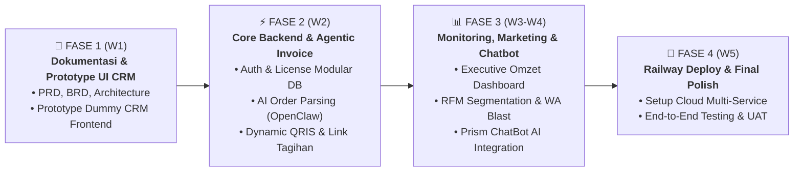
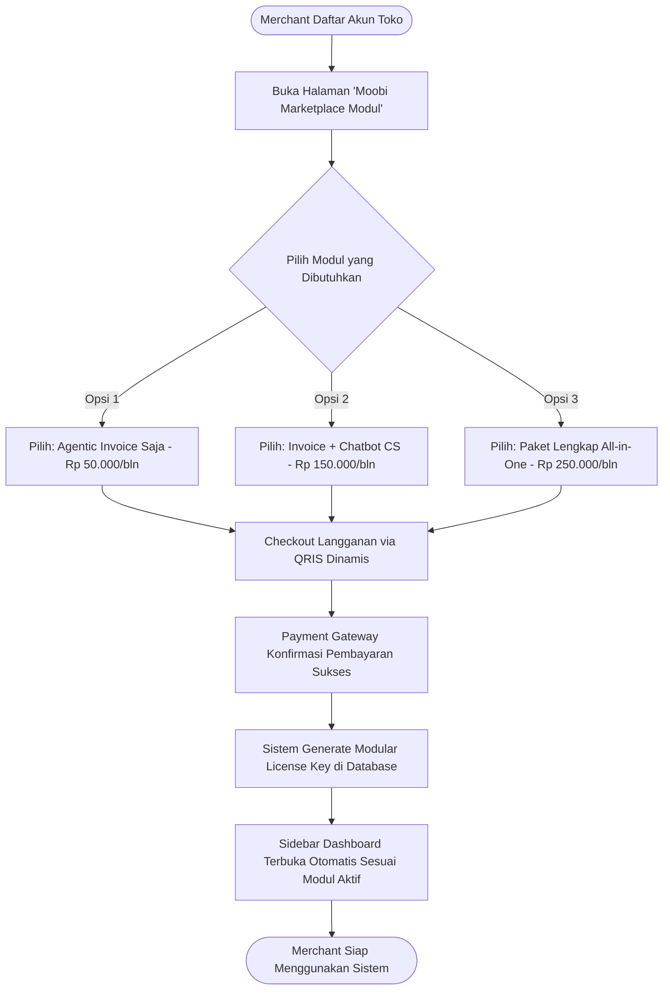
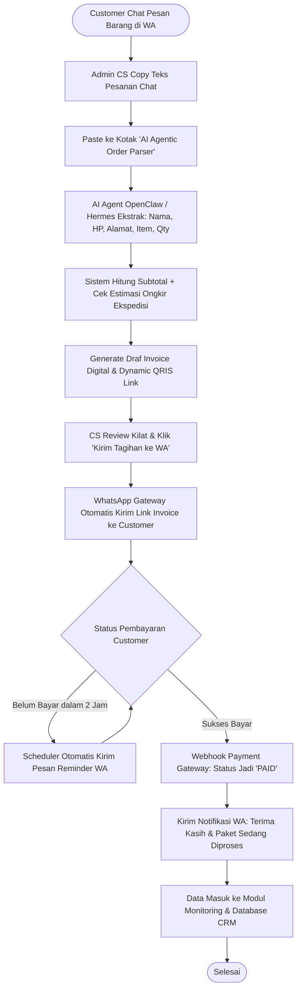
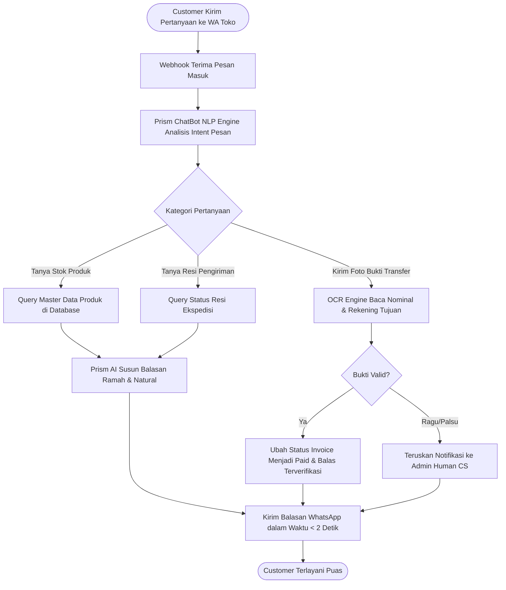
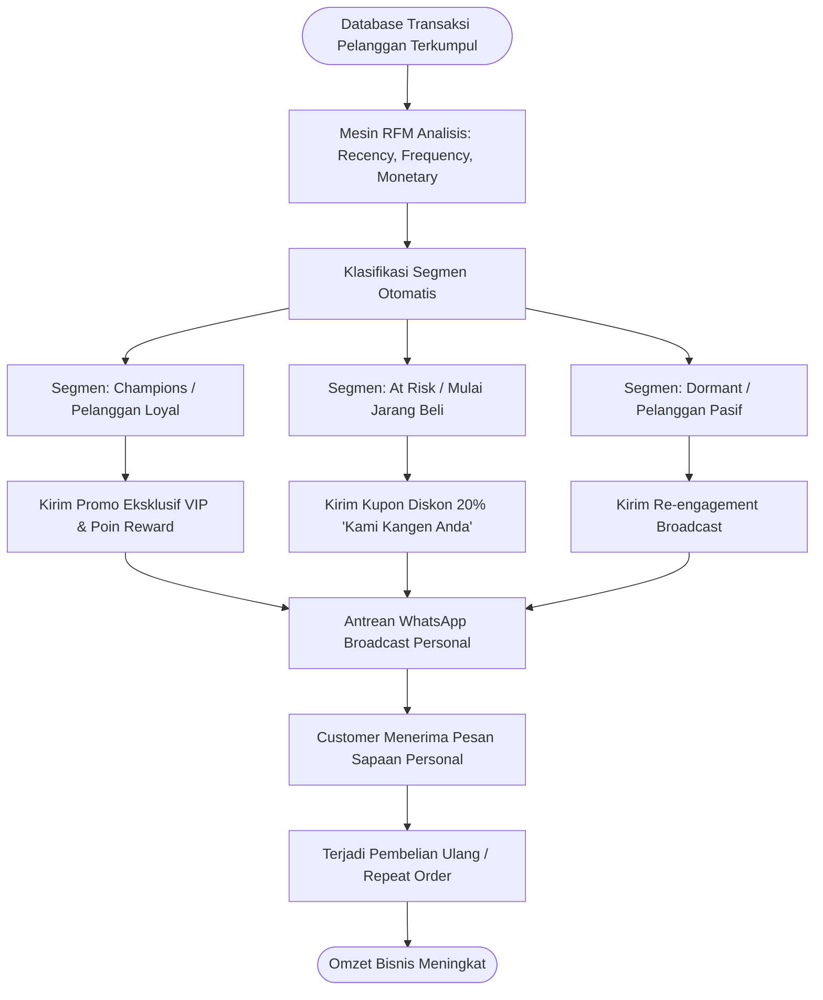

# MASTER PROJECT PLANNING (PLANNING.md)
## Proyek: Moobi Retail — Modular Agentic CRM & Commerce Enabler Ecosystem
**Tim:** 7 Developer (4 Frontend, 3 Backend)  
**Tujuan:** Membangun platform CRM cerdas modular berbasis AI (Benchmark: Komerce.id) yang di-deploy di Cloud (Railway untuk Testing/Staging; AWS/GCP/VPS untuk Production).

---

# 1. Yang Dibangun Terlebih Dahulu (Prioritas Eksekusi)

Untuk memastikan progres cepat dan dapat dipresentasikan ke atasan, urutan pembangunan dibagi menjadi **4 Fase Bertahap**:



### Rincian Prioritas Mingguan:
1. **Urutan #1 (Minggu 1)**: Membangun **Dokumentasi Lengkap** dan **Prototype Dummy UI CRM** (Frontend langsung membuat tampilan mockup interaktif agar atasan bisa melihat gambaran visual sistem terlebih dahulu).
2. **Urutan #2 (Minggu 2)**: Membangun **Core Platform (Auth & Lisensi Modular)** dan **Modul 1: Agentic Invoice** (AI membaca teks chat $\rightarrow$ membuat invoice QRIS).
3. **Urutan #3 (Minggu 3)**: Membangun **Modul 2: Monitoring & Tracking Resi** dan **Modul 3: Marketing Smart CRM (RFM)**.
4. **Urutan #4 (Minggu 4)**: Mengintegrasikan **Modul 4: Chatbot AI CS (Prism API)** dan **Modul 5: Marketplace Importer**.
5. **Urutan #5 (Minggu 5)**: Deployment penuh di **Railway Cloud Platform** (Testing) / VPS Produksi dan pengujian akhir (*Final Demo Presentation*).

---

# 2. Dokumentasi Perencanaan (Executive Summary Terpadu)

Agar atasan dan seluruh pemangku kepentingan dapat memahami keseluruhan proyek dalam satu dokumen tanpa harus membuka banyak file terpisah, berikut adalah **penjabaran intisari lengkap dari seluruh paket dokumen proyek**:

### 2.1 Ringkasan Kebutuhan Bisnis (Dari Dokumen BRD)
- **Problem Statement**: Penjual online (WhatsApp/Social Commerce) menghabiskan 60% waktu untuk urusan administrasi manual: membalas chat berulang, menghitung pesanan + ongkir, membuat tagihan manual, dan sering lupa follow-up tagihan yang belum dibayar (*unpaid invoices*).
- **Benchmark Bisnis**: Mengadopsi model kesuksesan **[Komerce.id](https://komerce.id)** (Komship, Komchat, Komads) yang memposisikan diri sebagai *Commerce Enabler* bagi UMKM dan Online Seller di Indonesia.
- **Model Monetisasi Modular (À la Carte)**:
  - Pelaku bisnis bebas memilih dan hanya membayar modul yang mereka gunakan (misal: hanya butuh Modul Invoice AI seharga Rp 50.000/bln).
  - Skema harga terjangkau: Mulai **Rp 50.000 / modul / bulan** hingga Paket Bundle All-in-One **Rp 250.000 / bulan**.

---

### 2.2 Ringkasan Spesifikasi Produk & Fitur (Dari Dokumen PRD)
Sistem berfokus pada **3 Pilar Inti CRM + 2 Modul Pendukung**:

| Modul | Nama Modul | Fungsi Utama & Nilai Manfaat | Target Pengguna |
| :---: | :--- | :--- | :--- |
| **Modul 1** | **Agentic Invoice (AI OpenClaw / Hermes)** | • AI membaca teks pesanan informal dari chat WhatsApp.<br>• Ekstraksi otomatis: Nama, HP, Alamat, Item, Qty, dan Kurir.<br>• Menerbitkan link tagihan resmi dengan **Dynamic QRIS** & reminder tagihan otomatis via WhatsApp. | Admin CS & Sales |
| **Modul 2** | **Commercial Monitoring & Resi** | • Dashboard analitik omzet harian & rata-rata nilai order.<br>• Tracking performa *closing rate* tim Admin CS.<br>• Pelacakan status live resi ekspedisi (JNE, J&T, SiCepat) dalam 1 tabel terpadu. | Owner & Manajer Bisnis |
| **Modul 3** | **Marketing & Smart CRM (RFM)** | • Segmentasi pelanggan otomatis berbasis **RFM (*Recency, Frequency, Monetary*)**.<br>• Klasifikasi: *Champions (Loyal), At Risk (Mulai Pasif), Dormant*.<br>• WhatsApp Broadcast promosi personal massal untuk memicu *repeat order*. | Tim Pemasaran / Owner |
| **Modul 4** | **Chatbot AI CS 24/7 (Prism Engine)** | • Asisten AI pintar untuk menjawab pertanyaan produk & jam buka 24/7.<br>• Cek ongkir dan status resi otomatis.<br>• Deteksi dan validasi gambar bukti transfer bank (*Receipt OCR*). | Customer / Pembeli |
| **Modul 5** | **Marketplace Importer** | • Impor massal katalog produk dan kontak pembeli dari Shopee/Tokopedia (file CSV/Excel) untuk memperkaya database CRM. | Admin Toko |

---

### 2.3 Ringkasan Arsitektur Teknis & Standar Keamanan (Dari Dokumen ARCHITECTURE)
- **Tech Stack Backend**: PHP 8.2+ dengan **Laravel 11 REST API** berbasis arsitektur *Clean Modular Domain*.
- **Tech Stack Frontend**: **React.js + Vite + Tailwind CSS + Shadcn UI** dengan navigasi sidebar dinamis (*Dynamic Modular License Filter*).
- **AI & NLP Worker**: Microservices **OpenClaw / Hermes** untuk agentic order parsing dan **Prism ChatBot AI API** untuk natural auto-reply.
- **Infrastruktur Cloud-Agnostic**:
  - *Fase Testing / Staging*: Menggunakan **Railway Cloud Platform** (deploy cepat multi-service: API, Worker, Redis, DB).
  - *Fase Production*: Docker Containerized Multi-Service (siap jalan di **AWS ECS, Google Cloud Run, DigitalOcean, atau Bare-Metal VPS**).
- **Standar Keamanan Enterprise (OWASP Top 10 & ISO 27001)**:
  - **HMAC SHA-256 Signature Verification** pada seluruh webhook masuk (WhatsApp & Payment Gateway) untuk mencegah manipulasi data.
  - **Prompt Injection Guardrails** untuk menyaring input teks bebas chat sebelum diproses oleh model AI.
  - **AES-256-GCM Encryption at Rest** untuk seluruh kunci API pihak ketiga.
  - **Redis Token Bucket Rate Limiting** untuk mencegah serangan brute force dan DDoS.
  - **Immutable Audit Trail** (log perubahan data yang tidak dapat dihapus/diubah).

---

### 2.4 Ringkasan Panduan Prototype Frontend (Dari Dokumen PROTOTYPE_CRM)
- **Tujuan Prototype**: Menghadirkan antarmuka mockup visual interaktif pada akhir Minggu ke-1 dengan data dummy JSON lokal (`invoices.json`, `rfm_segments.json`).
- **5 Layar Utama yang Disiapkan 4 Frontend Developer**:
  1. *Dynamic Sidebar & Modul Store* (Toggle aktivasi modul à la carte).
  2. *Playground Agentic Invoice* (Area paste chat $\rightarrow$ hasil invoice QRIS).
  3. *Executive Monitoring Dashboard* (Grafik visual omzet & pelacak resi kurir).
  4. *Marketing RFM Segment Visualizer* (Matriks pembagian segmen & broadcast WA).
  5. *Live Chatbot AI Simulator* (Mockup chat WhatsApp dengan auto-reply bot).

---

# 3. Alur Bisnis (Business Flow Terperinci & Diagram Mermaid)

Berikut adalah penjabaran 4 siklus alur bisnis utama dalam ekosistem Moobi Retail:

### 3.1 Alur Bisnis 1: Pembelian & Aktivasi Modul À la Carte oleh Merchant
Pelaku bisnis mendaftar, memilih modul yang dibutuhkan saja (misal hanya Modul Invoice seharga Rp 50rb), membayar langganan, dan dashboard otomatis membuka fitur tersebut.



---

### 3.2 Alur Bisnis 2: Pembuatan Agentic Invoice dari Percakapan Chat WhatsApp
Menghilangkan proses pembuatan faktur manual: Admin CS cukup menempelkan teks chat pembeli, AI Agent membaca entitas pesanan dan menerbitkan link bayar QRIS.



---

### 3.3 Alur Bisnis 3: Layanan Chatbot AI Customer Service 24/7 (Prism Engine)
Melayani calon pembeli sepanjang waktu tanpa jeda untuk menjawab FAQ seputar produk, cek ongkir, status pesanan, dan cek slip transfer bank.



---

### 3.4 Alur Bisnis 4: Smart Marketing CRM & Segmentasi RFM
Meningkatkan *repeat order* dengan mengelompokkan pelanggan lama secara otomatis dan mengirimkan penawaran diskon personal.



---

# 4. Prototype CRM (Gambaran Proyek Dummy Frontend)

Untuk kebutuhan demonstrasi cepat ke atasan sebelum backend selesai, tim Frontend akan membuat **Prototype CRM Interaktif** yang memuat:
1. **Interactive Sidebar**: Menu dinamis dengan indikator modul aktif vs terkunci.
2. **AI Invoice Generator Playground**: Area simulasi menempelkan chat dan melihat hasil parsing AI secara instan.
3. **Executive Monitoring Dashboard**: Grafik omzet visual, rasio invoice terbayar, dan pelacak resi kurir.
4. **Marketing RFM Segment Visualizer**: Diagram visual pembagian pelanggan (Loyal, Butuh Perhatian, Pasif).
5. **Chatbot Live Simulator**: Widget chat interaktif untuk menguji respon bot AI Prism.

---

# 5. Estimasi Waktu Penyelesaian (Timeline Tim 7 Orang)

Pengerjaan dibagi ke dalam **5 Sprint Mingguan** dengan alokasi tugas terstruktur untuk **4 Frontend Developer** dan **3 Backend Developer**:

```
[ Minggu 1: Dokumen & Prototype UI CRM ]
                  │
                  ▼
[ Minggu 2: Core Platform & Agentic Invoice AI ]
                  │
                  ▼
[ Minggu 3: Monitoring & Marketing Smart CRM ]
                  │
                  ▼
[ Minggu 4: Chatbot AI CS & Marketplace Importer ]
                  │
                  ▼
[ Minggu 5: Deploy ke Railway, Testing & Final Demo ]
```

### Matriks Pembagian Tugas Tim 7 Orang:

| Anggota Tim | Role | Fokus Pengerjaan Utama |
| :--- | :--- | :--- |
| **Backend 1** | **Backend Lead & Core Architect** | Setup repositori, deploy **Railway**, DB Migrations, Auth Sanctum, dan Middleware Lisensi Modular (`CheckModuleSubscribed`). |
| **Backend 2** | **Invoice & Monitoring Engineer** | API Agentic Invoice, integrasi payment gateway QRIS dinamis, dan agregasi data analitik Monitoring. |
| **Backend 3** | **AI Agent & Chatbot Integrator** | Integrasi AI Agent (**OpenClaw/Hermes**) untuk parsing order dan integrasi **Prism ChatBot AI API**. |
| **Frontend 1** | **Frontend Lead & Layout Architect** | Setup project Vite React, AppLayout, Dynamic Sidebar modular, Auth, dan state management lisensi. |
| **Frontend 2** | **Invoice & Marketplace UI Dev** | Layar Playground AI Chat-to-Invoice, halaman daftar invoice, dan import katalog marketplace. |
| **Frontend 3** | **Monitoring & Analytics UI Dev** | Dashboard metrik omzet harian (Recharts/Chart.js), tabel tracking resi, dan leaderboard closing CS. |
| **Frontend 4** | **Marketing CRM & Chatbot UI Dev** | Visualisasi segmentasi RFM pelanggan, antarmuka WhatsApp Broadcast, dan simulator live Chatbot AI. |

- **Target Selesai Prototype UI**: **Akhir Minggu ke-1 (Hari ke-5 pengerjaan)**.
- **Target Selesai Sistem Penuh**: **Minggu ke-5**.
