# Product Requirement Document (PRD)
## Moobi Retail — Modular Agentic CRM & Commerce Enabler Ecosystem

**Version number:** V3.0.0

| Version | Date | Revised by | Notes |
| :--- | :--- | :--- | :--- |
| V1.0.0 | 2026/09/10 | Tim Moobi Retail (Lead) | Initial PRD release |
| V2.0.0 | 2026/09/10 | Tim Moobi Retail (Lead) | Added Omnichannel E-Commerce Storefront |
| V3.0.0 | 2026/09/11 | Tim Moobi Retail (Lead) | **Major Pivot — Agentic CRM & Modular Commerce Enabler Edition (Benchmark: Komerce.id)**:<br>• Arsitektur Modular À la Carte (beli modul sesuai kebutuhan).<br>• 3 Pilar Inti: **Agentic Invoice (AI OpenClaw/Hermes)**, **Monitoring**, & **Marketing CRM**.<br>• Integrasi **Chatbot AI CS 24/7** (Prism ChatBot API repo) & **Railway Cloud Deployment**.<br>• Pergudangan fisik kompleks disederhanakan/ditiadakan sesuai arahan. |

---

# Table of Contents
- [I. Overview (Why)](#i-overview-why)
  - [1.1 Product overview & objectives](#11-product-overview--objectives)
    - [1.1.1 Background](#111-background)
    - [1.1.2 Product overview](#112-product-overview)
    - [1.1.3 Product goals](#113-product-goals)
    - [1.1.4 Target users](#114-target-users)
  - [1.2 Glossary](#12-glossary)
  - [1.3 Roles & permissions](#13-roles--permissions)
  - [1.4 Intended audience](#14-intended-audience)
- [II. Product description (What)](#ii-product-description-what)
  - [2.1 Requirements summary](#21-requirements-summary)
  - [2.2 End-to-end flows (System Level)](#22-end-to-end-flows-system-level)
    - [2.2.1 Main flow (Agentic Invoice & Order Lifecycle)](#221-main-flow-agentic-invoice--order-lifecycle)
    - [2.2.2 Sub-flows (Chatbot AI CS & Marketing Broadcast)](#222-sub-flows-chatbot-ai-cs--marketing-broadcast)
    - [2.2.3 Data Flow Diagram (DFD Level 1 Modular Engine)](#223-data-flow-diagram-dfd-level-1-modular-engine)
    - [2.2.4 State Transition Diagram (STD Status Invoice & Order)](#224-state-transition-diagram-std-status-invoice--order)
  - [2.3 User-Specific Flowcharts (Role Level)](#23-user-specific-flowcharts-role-level)
    - [2.3.1 Merchant / Seller (Mengelola Bisnis & Beli Modul)](#231-merchant--seller-mengelola-bisnis--beli-modul)
    - [2.3.2 Admin CS / Sales (Agentic Invoice & Chatbot Assisted)](#232-admin-cs--sales-agentic-invoice--chatbot-assisted)
    - [2.3.3 Customer / Pembeli (Interaksi Chatbot & Bayar Invoice)](#233-customer--pembeli-interaksi-chatbot--bayar-invoice)
  - [2.4 System Sequence Diagrams (Interaction Level)](#24-system-sequence-diagrams-interaction-level)
    - [2.4.1 SD 1: Agentic Invoice Creation via AI OpenClaw / Hermes](#241-sd-1-agentic-invoice-creation-via-ai-openclaw--hermes)
    - [2.4.2 SD 2: Chatbot AI CS Auto-Reply (Prism API Engine)](#242-sd-2-chatbot-ai-cs-auto-reply-prism-api-engine)
    - [2.4.3 SD 3: Smart Marketing Segmentation & WhatsApp Broadcast](#243-sd-3-smart-marketing-segmentation--whatsapp-broadcast)
    - [2.4.4 SD 4: Unified Business Monitoring & Order Tracking](#244-sd-4-unified-business-monitoring--order-tracking)
  - [2.5 Global guidelines](#25-global-guidelines)
  - [2.6 Version plan (Milestones)](#26-version-plan-milestones)
  - [2.7 Product framework (Modular SaaS Architecture)](#27-product-framework-modular-saas-architecture)
  - [2.8 Feature list](#28-feature-list)
- [III. Functional requirements (How)](#iii-functional-requirements-how)
  - [3.1 Module 0: Core Platform & Modular License Management](#31-module-0-core-platform--modular-license-management)
  - [3.2 Module 1: Agentic Invoice (OpenClaw / Hermes AI)](#32-module-1-agentic-invoice-openclaw--hermes-ai)
  - [3.3 Module 2: Monitoring & Commercial Analytics](#33-module-2-monitoring--commercial-analytics)
  - [3.4 Module 3: Marketing & Smart CRM (RFM Segmentation)](#34-module-3-marketing--smart-crm-rfm-segmentation)
  - [3.5 Module 4: Chatbot AI Customer Service (Prism API Engine)](#35-module-4-chatbot-ai-customer-service-prism-api-engine)
  - [3.6 Module 5: Marketplace Importer (Shopee / Tokopedia)](#36-module-5-marketplace-importer-shopee--tokopedia)
- [IV. Non-functional requirements (Notes)](#iv-non-functional-requirements-notes)
- [V. Appendix (Supplementary)](#v-appendix-supplementary)
  - [5.1 Acceptance criteria & test points](#51-acceptance-criteria--test-points)

---

# I. Overview (Why)

## 1.1 Product overview & objectives

### 1.1.1 Background
Banyak online seller, brand retail UMKM, dan pebisnis sosial media di Indonesia (menjual via WhatsApp, Instagram, dan Marketplace) kewalahan dalam mengelola pesanan secara manual:
- Admin CS menghabiskan waktu berjam-jam hanya untuk menghitung total tagihan, mengecek ongkos kirim, dan membuat invoice satu per satu.
- Banyak invoice yang tidak terbayar (*unpaid*) karena tidak ada sistem pengingat otomatis (*follow-up reminder*).
- Database pembeli tidak pernah diolah untuk promosi ulang (*retargeting*), sehingga omzet bergantung terus pada biaya iklan yang mahal.
- Pebisnis enggan membeli software ERP komplit yang mahal karena mereka hanya membutuhkan fitur spesifik seperti pembuat invoice otomatis dan chatbot CS.

### 1.1.2 Product overview
**Moobi Retail V3.0** adalah platform **Modular Agentic CRM & Commerce Enabler** (mengacu pada model benchmark **Komerce.id**) yang memungkinkan merchant mengotomasi proses penjualan dengan bantuan **Agentic AI**:
1. **Model Pembelian Modular (À la Carte)**: Merchant bebas memilih & hanya membayar modul yang mereka butuhkan (mulai Rp 50.000/bulan).
2. **Agentic Invoice (OpenClaw / Hermes)**: Pembuatan invoice otomatis langsung dari teks percakapan chat pembeli lengkap dengan tautan pembayaran QRIS dinamis & reminder WhatsApp.
3. **Unified Monitoring**: Dashboard monitoring grafik omzet harian, performa closing admin sales, dan pelacakan resi kurir.
4. **Smart Marketing CRM**: Analisis segmentasi RFM (*Recency, Frequency, Monetary*) dan blast WhatsApp promo tertarget.
5. **Chatbot AI CS 24/7 (Prism Engine)**: Layanan asisten cerdas otomatis untuk menjawab pertanyaan produk dan validasi bukti transfer.

### 1.1.3 Product goals
- 📈 **Business goals**:
  - Menghadirkan solusi CRM Agentic dengan *entry barrier* rendah melalui sistem langganan per modul.
  - Membantu merchant meningkatkan *conversion rate* dan menekan *unpaid invoice* hingga 40% melalui follow-up otomatis.
  - Menghemat biaya operasional customer service dengan integrasi Chatbot AI 24/7.
- 👤 **User goals**:
  - **Merchant / Owner**: Memantau kesehatan bisnis dan performa tim dalam satu layar tanpa perlu setup sistem yang rumit.
  - **Admin CS / Sales**: Membuat invoice dalam $< 5$ detik cukup dengan menempelkan chat pembeli ke AI Agent.
  - **Customer**: Mendapatkan respon instan 24/7, rincian tagihan yang jelas, dan kemudahan bayar via QRIS.

### 1.1.4 Target users
- **Online Sellers & UMKM**: Penjual di WhatsApp, Instagram, dan TikTok Shop.
- **Brand Retail & Distributor**: Bisnis dengan banyak tim sales/CS yang membutuhkan tracking closing rate.
- **Admin Customer Service**: Bertugas melayani chat pembeli dan membuat invoice.
- **Owner / Manajer Bisnis**: Membutuhkan analitik omzet dan retensi pelanggan.

---

## 1.2 Glossary

| Istilah | Definisi & Penjelasan |
| :--- | :--- |
| **Agentic AI** | Sistem kecerdasan buatan otonom yang dapat mengambil tindakan logis (membaca teks, memanggil API, membuat data) secara mandiri. |
| **OpenClaw / Hermes** | Framework AI Agent yang digunakan untuk mengotomasi ekstraksi data pesanan dan pembuatan invoice. |
| **Prism ChatBot API** | Engine chatbot berbasis NLP/LLM untuk layanan auto-reply customer service 24/7. |
| **À la Carte Subscription** | Skema langganan software per modul independen, bukan paket kaku all-in-one. |
| **RFM Analysis** | Metode segmentasi pelanggan berdasarkan *Recency* (kapan terakhir beli), *Frequency* (seberapa sering beli), dan *Monetary* (berapa total belanjanya). |
| **Dynamic QRIS** | Kode QR pembayaran standar Indonesia dengan nominal tagihan yang sudah terisi otomatis dan berubah per invoice. |
| **Railway** | Platform cloud PaaS modern tempat aplikasi backend, worker AI, dan database di-deploy. |

---

## 1.3 Roles & permissions

| Role ID | Role Name | Platform | Permissions Boundary |
| :--- | :--- | :--- | :--- |
| **ROLE_MERCHANT_OWNER** | Pemilik Toko / Super Admin | Web Dashboard | Akses penuh dashboard, aktivasi/pembelian modul à la carte, konfigurasi payment gateway, dan analitik monitoring. |
| **ROLE_ADMIN_SALES** | Admin CS / Sales Staff | Web Dashboard | Menggunakan modul Agentic Invoice, input order, melihat riwayat chat pelanggan, dan followup tagihan. |
| **ROLE_MARKETING** | Staf Pemasaran | Web Dashboard | Mengakses modul Marketing CRM, membuat segmentasi RFM, dan menyusun blast pesan WhatsApp promo. |
| **ROLE_CUSTOMER** | Pembeli Luar | WhatsApp / Web Link | Menerima invoice digital, membayar via QRIS/VA, dan berinteraksi dengan Chatbot AI CS. |

---

## 1.4 Intended audience
Dokumen ini disusun untuk panduan tim pengembang 7 orang: Backend Engineer, AI Integrator (OpenClaw & Prism), Frontend Developer, dan QA Engineer.

---

# II. Product description (What)

## 2.1 Requirements summary
Moobi Retail V3.0 dirancang dengan arsitektur **Modular Hub** yang terdiri dari:
1. **Core Platform**: Manajemen autentikasi, multi-tenant, dan aktivasi modul per merchant.
2. **Modul 1 (Agentic Invoice)**: Otomasi pembuatan invoice via AI Agent, link QRIS, dan reminder WA.
3. **Modul 2 (Monitoring)**: Analitik omzet, performa closing admin, dan tracking resi ekspedisi.
4. **Modul 3 (Marketing CRM)**: Segmentasi cerdas RFM & broadcast WhatsApp personal.
5. **Modul 4 (Chatbot AI CS)**: Auto-reply CS 24/7 menggunakan Prism AI API.
6. **Modul 5 (Marketplace Importer)**: Impor data produk & database pembeli Shopee/Tokopedia.

---

## 2.2 End-to-end flows (System Level)

### 2.2.1 Main flow (Agentic Invoice & Order Lifecycle)

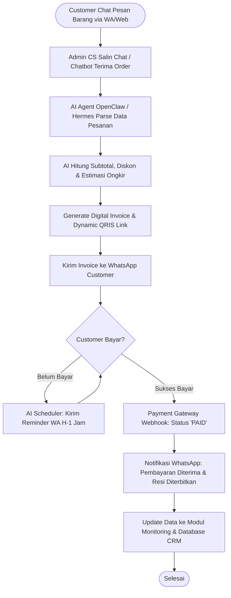

### 2.2.2 Sub-flows (Chatbot AI CS & Marketing Broadcast)

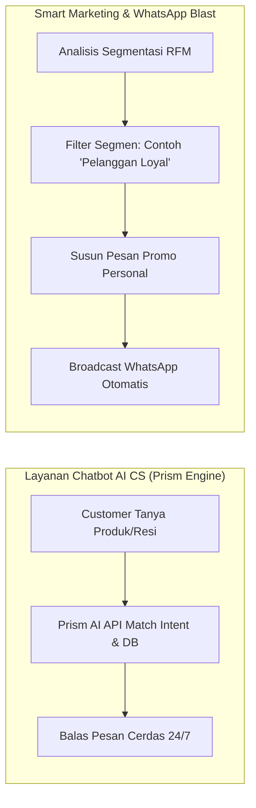

### 2.2.3 Data Flow Diagram (DFD Level 1 Modular Engine)

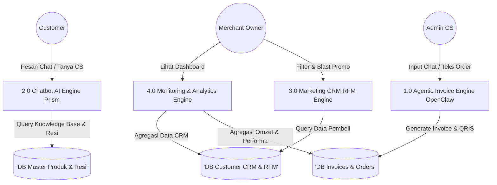

### 2.2.4 State Transition Diagram (STD Status Invoice & Order)

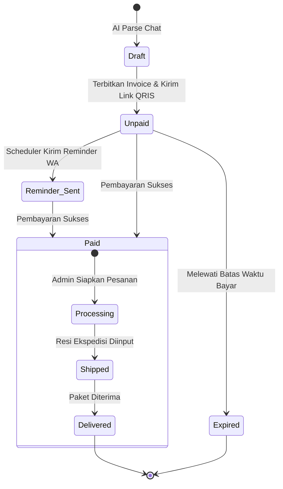

---

## 2.3 User-Specific Flowcharts (Role Level)

### 2.3.1 Merchant / Seller (Mengelola Bisnis & Beli Modul)

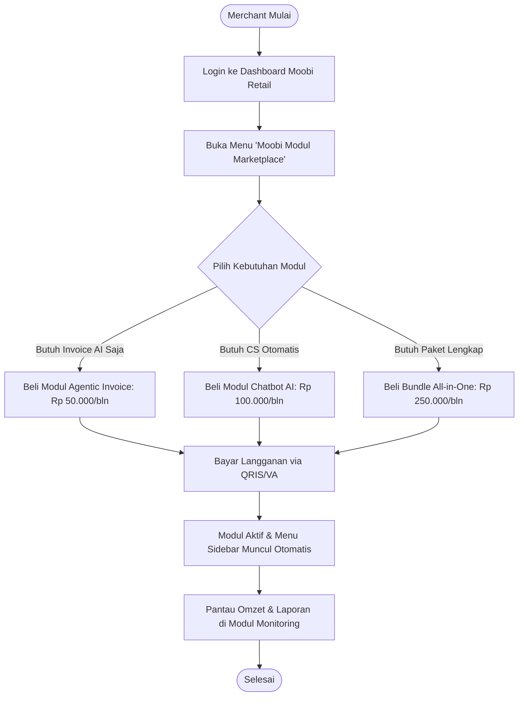

### 2.3.2 Admin CS / Sales (Agentic Invoice & Chatbot Assisted)

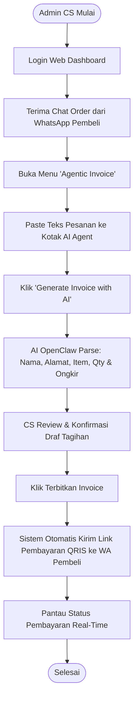

### 2.3.3 Customer / Pembeli (Interaksi Chatbot & Bayar Invoice)

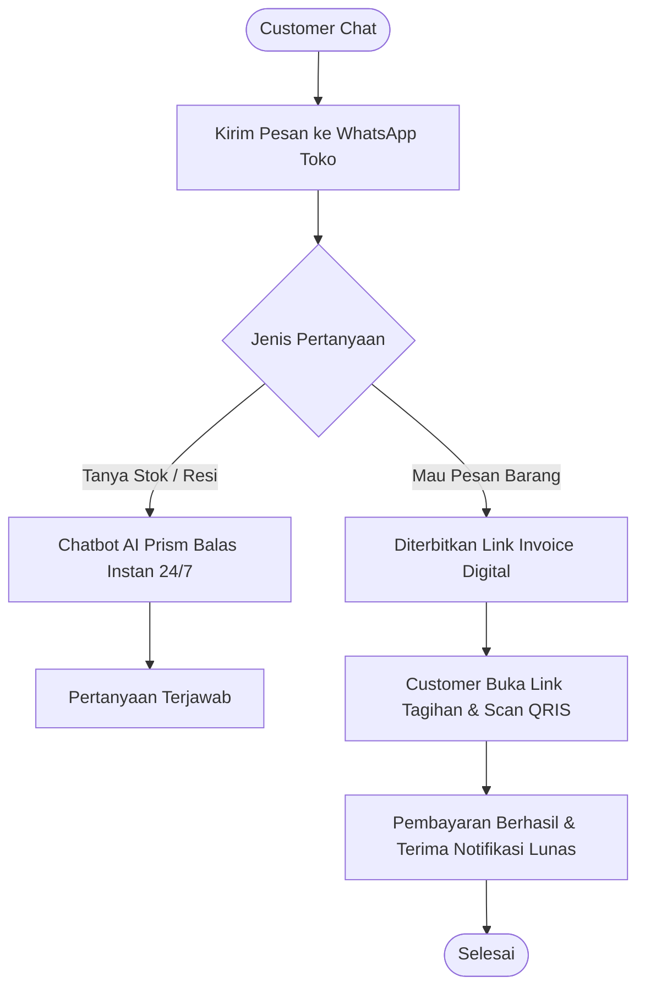

---

## 2.4 System Sequence Diagrams (Interaction Level)

### 2.4.1 SD 1: Agentic Invoice Creation via AI OpenClaw / Hermes

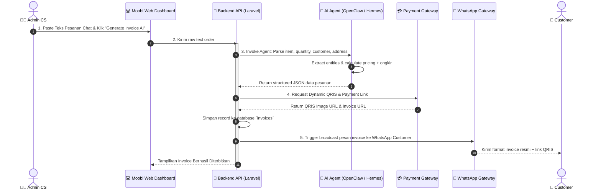

### 2.4.2 SD 2: Chatbot AI CS Auto-Reply (Prism API Engine)

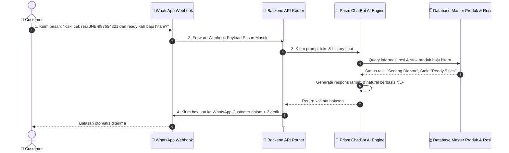

### 2.4.3 SD 3: Smart Marketing Segmentation & WhatsApp Broadcast

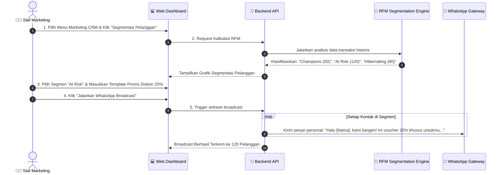

### 2.4.4 SD 4: Unified Business Monitoring & Order Tracking

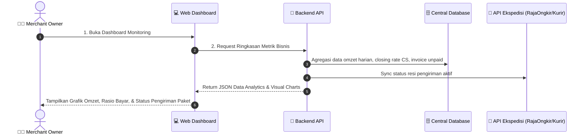

---

## 2.5 Global guidelines
- **Exception Handling**: Notifikasi error informatif saat parsing AI gagal dengan fallback ke form input manual, serta auto-retry webhook payment gateway.
- **Dynamic Modular Navigation**: Sistem otomatis menyembunyikan/menonaktifkan menu modul yang belum dilanggan oleh merchant.
- **Responsive Web**: Optimal diakses melalui browser laptop/PC maupun browser smartphone.

---

## 2.6 Version plan (Milestones)

```
[ Minggu 1: Setup Railway, DB Schema & Prototype UI CRM ]
                           │
                           ▼
[ Minggu 2: Core Platform & Modul Agentic Invoice (OpenClaw) ]
                           │
                           ▼
[ Minggu 3: Modul Monitoring & Marketing Smart CRM (RFM) ]
                           │
                           ▼
[ Minggu 4: Integrasi Chatbot AI CS (Prism API) & Marketplace Importer ]
                           │
                           ▼
[ Minggu 5: End-to-End Testing, Railway Deployment & Final Demo ]
```

---

## 2.7 Product framework (Modular SaaS Architecture)

```
+---------------------------------------------------------------------------------------------------+
|                            MOOBI RETAIL MODULAR AGENTIC CRM ECOSYSTEM                             |
+---------------------------------------------------------------------------------------------------+
                                                  |
                  +-------------------------------+-------------------------------+
                  |                               |                               |
                  v                               v                               v
      +-----------------------+       +-----------------------+       +-----------------------+
      | 1. MOOBI WEB DASHBOARD|       | 2. AI AGENT ENGINE    |       | 3. PRISM CHATBOT API  |
      | (React / Vite + UI)   |       | (OpenClaw / Hermes)   |       | (Node.js NLP Engine)  |
      | - Dynamic Modular Menu|       | - Chat Order Parser   |       | - 24/7 CS Auto-Reply  |
      | - Monitoring & Charts |       | - Dynamic QRIS Gen    |       | - Receipt OCR Reader  |
      +-----------------------+       +-----------------------+       +-----------------------+
                  |                               |                               |
                  +-------------------------------+-------------------------------+
                                                  |
                                                  v
                                      +-----------------------+
                                      | CENTRAL REST API      |
                                      | (Laravel 11 Backend)  |
                                      +-----------------------+
                                                  |
                     +----------------------------+----------------------------+
                     |                            |                            |
                     v                            v                            v
          +---------------------+      +---------------------+      +---------------------+
          | MODULAR LICENSE     |      | RFM SEGMENTATION    |      | PAYMENT & WHATSAPP  |
          | MIDDLEWARE ENGINE   |      | MARKETING ENGINE    |      | WEBHOOK GATEWAY     |
          +---------------------+      +---------------------+      +---------------------+
                                                  |
                                                  v
                                      +-----------------------+
                                      | POSTGRESQL / MYSQL DB |
                                      | (Hosted on Railway)   |
                                      +-----------------------+
```

---

## 2.8 Feature list

| Modul Code | Module Name | Feature Name | Description | Priority |
| :---: | :--- | :--- | :--- | :---: |
| **COR-01** | Core Platform | Modular Subscription Manager | Aktivasi lisensi modul à la carte per merchant (beli modul terpisah). | **P0** |
| **COR-02** | Core Platform | Dynamic Navigation UI | Sidebar dashboard otomatis beradaptasi menampilkan modul yang aktif. | **P0** |
| **INV-01** | Agentic Invoice | AI Natural Text Order Parser | OpenClaw/Hermes mengekstrak nama, item, kuantitas & alamat dari chat. | **P0** |
| **INV-02** | Agentic Invoice | Dynamic QRIS Payment Link | Menghasilkan link tagihan dengan QRIS dinamis & nomor VA otomatis. | **P0** |
| **INV-03** | Agentic Invoice | WhatsApp Auto-Reminder | Pengingat otomatis invoice belum bayar via pesan WhatsApp. | **P0** |
| **INV-04** | Agentic Invoice | Payment Webhook Reconciliation| Status invoice otomatis berubah menjadi LUNAS saat ada pembayaran. | **P0** |
| **MON-01** | Monitoring | Executive Revenue KPI | Grafik omzet harian, rata-rata nilai order, & tren pertumbuhan bisnis. | **P0** |
| **MON-02** | Monitoring | CS Performance & Closing Rate | Laporan jumlah invoice terbit, kecepatan respon, & rasio keberhasilan. | **P0** |
| **MON-03** | Monitoring | Unified Shipping Tracking | Pelacakan status resi ekspedisi (JNE, J&T, SiCepat) dalam 1 tabel. | **P0** |
| **MKT-01** | Marketing CRM | RFM Segmentation Engine | Pengelompokan otomatis pelanggan: Loyal, Butuh Perhatian, & Pasif. | **P0** |
| **MKT-02** | Marketing CRM | Smart WA Promo Broadcast | Kirim pesan promosi personal ke segmen pelanggan tertentu secara massal. | **P0** |
| **MKT-03** | Marketing CRM | Loyalty Points System | Akumulasi poin belanja pelanggan dan penukaran poin promo. | **P1** |
| **BOT-01** | Chatbot AI CS | 24/7 AI Auto-Responder | Menjawab chat seputar produk & FAQ otomatis berbasis Prism API repo. | **P0** |
| **BOT-02** | Chatbot AI CS | Receipt Image Verification | Deteksi gambar slip bukti transfer bank secara otomatis. | **P1** |
| **IMP-01** | Marketplace Importer| Parser CSV/Excel Shopee/Tokopedia| Impor massal data produk dan order lampau dari marketplace. | **P0** |

---

# III. Functional requirements (How)

## 3.1 Module 0: Core Platform & Modular License Management
- **Deskripsi**: Pusat manajemen akun merchant, tim karyawan, dan modul berlangganan. Merchant dapat mengaktifkan modul secara mandiri (À la Carte).
- **Data Dictionary**: `merchant_id`, `merchant_name`, `subscribed_modules (JSON array: ['invoice', 'monitoring', 'marketing', 'chatbot'])`, `subscription_status`, `expired_at`.

## 3.2 Module 1: Agentic Invoice (OpenClaw / Hermes AI)
- **Deskripsi**: Fitur generator invoice pintar di mana admin hanya perlu menempelkan teks percakapan dari pembeli, kemudian AI Agent memproses data pesanan, menghitung ongkos kirim, dan menerbitkan link pembayaran QRIS resmi.
- **Data Dictionary**: `invoice_id`, `invoice_no`, `customer_name`, `customer_phone`, `items_json`, `subtotal`, `shipping_cost`, `grand_total`, `payment_status (unpaid/paid)`, `payment_url`, `qris_string`.

## 3.3 Module 2: Monitoring & Commercial Analytics
- **Deskripsi**: Dashboard analitik terpadu untuk memantau omzet harian, membandingkan performa closing tim sales/CS, dan memantau status pengiriman paket resi ekspedisi secara terpusat.

## 3.4 Module 3: Marketing & Smart CRM (RFM Segmentation)
- **Deskripsi**: Mesin segmentasi pelanggan berbasis algoritma RFM (*Recency, Frequency, Monetary*) yang memungkinkan merchant melakukan kampanye WhatsApp broadcast tertarget untuk meningkatkan pembelian ulang (*repeat order*).

## 3.5 Module 4: Chatbot AI Customer Service (Prism API Engine)
- **Deskripsi**: Layanan chatbot otomatis 24/7 terintegrasi WhatsApp yang menggunakan NLP dari repository Prism ChatBot AI API untuk melayani tanya-jawab produk, pengecekan resi, dan validasi transfer.

## 3.6 Module 5: Marketplace Importer (Shopee / Tokopedia)
- **Deskripsi**: Parser file ekspor CSV/Excel marketplace untuk mengimpor daftar produk dan kontak pembeli ke dalam database CRM Moobi dalam waktu singkat.

---

# IV. Non-functional requirements (Notes)
- **Deployment Platform**: Di-deploy pada **Railway Cloud Platform** dengan arsitektur microservices terisolasi (API backend, Redis cache, AI worker, dan database).
- **AI Processing Speed**: Ekstraksi pesanan via OpenClaw / Hermes selesai dalam waktu $< 5$ detik; respon Chatbot Prism $< 2$ detik.
- **Security**: Token-based authentication, enkripsi data rahasia API key, dan proteksi middleware per modul lisensi.
- **SLA Uptime**: Ketersediaan sistem minimum 99.8%.

---

# V. Appendix (Supplementary)

## 5.1 Acceptance criteria & test points

| Test ID | Area Uji | Skenario Pengujian | Kriteria Lulus (Passing Criteria) |
| :---: | :--- | :--- | :--- |
| **TC-MOD-01** | Modular License | Merchant hanya membeli Modul Invoice (Rp 50rb) | Sistem hanya mengaktifkan menu Invoice; menu Monitoring & Marketing terkunci rapi. |
| **TC-INV-01** | Agentic Invoice | Admin paste chat: *"Kak pesan baju hitam size L 2pcs kirim ke Jl Mawar Malang via JNE"* | AI Agent sukses mengekstrak produk, qty 2, alamat Malang, dan menghasilkan link QRIS dalam $< 5$ detik. |
| **TC-INV-02** | WA Auto-Reminder | Invoice belum dibayar setelah 2 jam | Sistem otomatis mengirim pesan pengingat sopan ke WhatsApp pembeli lengkap dengan tombol bayar. |
| **TC-BOT-01** | Chatbot AI CS | Customer chat: *"Baju ukuran L warna navy ready kak?"* | Chatbot berbasis Prism API membalas otomatis dengan informasi stok yang akurat dalam $< 2$ detik. |
| **TC-MKT-01** | Marketing CRM | Jalankan kalkulasi RFM pada 500 database pembeli | Sistem berhasil mengelompokkan pelanggan ke dalam segmen Loyal, At Risk, dan Dormant. |
| **TC-MON-01** | Monitoring | Terjadi pembayaran 5 invoice dalam 1 hari | Grafik omzet harian dan rasio closing rate admin CS langsung ter-update seketika. |
| **TC-DEP-01** | Deployment | Seluruh servis dijalankan di Railway Cloud | Backend API, worker AI, dan database aktif serta dapat diakses online tanpa kendala koneksi. |

---

*Moobi Retail • PT. ABSystem Technology Solution • amri@moobi.id • 0811-815-015 • www.moobi.id • No. Dok: MBI-PRD-BRD-2026-003*
