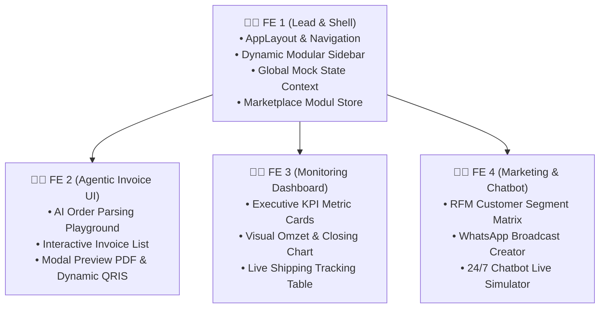

# PANDUAN PENGEMBANGAN PROTOTYPE CRM (PROTOTYPE_CRM.md)
## Panduan Lengkap untuk Tim Frontend (4 Orang Developer)

**Tujuan Dokumen:**  
Memberikan spesifikasi desain visual, struktur komponen React, data dummy JSON, dan alur interaktivitas untuk membuat **Prototype Dummy UI Moobi CRM** dalam waktu cepat (Minggu ke-1) sebelum Backend API selesai dikembangkan.

---

# 1. Konsep & Arsitektur Frontend Prototype

Prototype CRM dibangun menggunakan **React.js (Vite) + Tailwind CSS + Lucide React Icons + Recharts / Chart.js + Shadcn UI**.

### 1.1 Prinsip Utama Prototype:
1. **Mock Service Worker / Local Dummy JSON**: Semua data (invoice, grafik omzet, customer RFM, dan pesan chat) menggunakan state lokal / file dummy `.json` sehingga UI dapat beroperasi 100% interaktif tanpa menunggu API backend.
2. **Modular Toggle Simulator**: Terdapat tombol pengubah peran di pojok atas: *"Simulasi Toko Paket Invoice Saja"*, *"Simulasi Paket Lengkap"*, dsb., yang langsung mengubah tampilan menu sidebar.
3. **Wow Effect Design**: Menggunakan palette warna modern (Dark Indigo / Slate Navy / Emerald Accent), card glassmorphism halus, visual chart interaktif, dan animasi transisi responsif.

---

# 2. Pembagian Tugas 4 Frontend Developer



---

# 3. Rincian Detail 5 Halaman Utama Prototype

---

### Halaman 1: Dynamic Modular Sidebar & Marketplace Modul (`FE 1`)
- **Tujuan**: Mendemonstrasikan bahwa sistem ini fleksibel dan bisa dibeli per modul (À la Carte).
- **Komponen UI**:
  - **Sidebar Navigasi**: Menampilkan menu *Dashboard, Agentic Invoice, Monitoring, Marketing CRM, Chatbot CS, Marketplace Importer*.
  - **Badge Status Modul**: Modul yang aktif diberi icon hijau `[Active]`, modul yang belum dibeli diberi icon gembok `[Locked 🔒]`.
  - **Halaman 'Moobi Marketplace Modul'**: Menampilkan kartu-kartu modul dengan harga (Rp 50rb/bln, Rp 100rb/bln) dan tombol `[Aktifkan / Coba 14 Hari]`. Saat diklik, menu di sidebar seketika terbuka tanpa reload.

---

### Halaman 2: Playground Agentic Invoice (`FE 2`)
- **Tujuan**: Menunjukkan keunggulan AI Agent (*OpenClaw/Hermes*) dalam mengubah percakapan chat pembeli menjadi tagihan invoice resmi.
- **Komponen UI**:
  - **Split View 2 Kolom**:
    - **Sisi Kiri (Chat Input Box)**: Textarea besar tempat menempelkan chat mentah pembeli + 3 tombol *Preset Dummy Chat* (Contoh: *"Pesanan 2 Pcs Baju Malang"*, *"Pesanan Grosir Surabaya"*).
    - **Tombol Aksi**: Tombol dengan animasi gradien `[✨ Generate Invoice with AI Agent]`.
    - **Sisi Kanan (Generated Invoice Card)**: Hasil ekstraksi otomatis yang menampilkan:
      - Nama Pembeli & Nomor WhatsApp.
      - Alamat Pengiriman & Kurir Terdeteksi.
      - Tabel Item Barang, Qty, Harga Satuan, dan Subtotal.
      - Kalkulasi Ongkos Kirim & Diskon.
      - Total Tagihan & Gambar QRIS Dinamis.
  - **Tombol `[Kirim Tagihan ke WhatsApp]`**: Menampilkan simulasi popup preview pesan WhatsApp yang siap dikirim.

---

### Halaman 3: Executive Monitoring & Analytics Dashboard (`FE 3`)
- **Tujuan**: Menampilkan metrik performa bisnis secara real-time seperti pada dashboard Komerce.id.
- **Komponen UI**:
  - **4 Top Stat Cards**:
    - 💰 *Total Omzet Bulan Ini*: Rp 48.500.000 (+14.2%).
    - 📄 *Invoice Terbit vs Lunas*: 342 Invoice (88% Closing Rate).
    - 🚚 *Paket Dalam Pengiriman*: 24 Resi Aktif.
    - 👥 *Total Database Pelanggan*: 1.250 Kontak.
  - **Grafik Interaktif (Recharts / Chart.js)**:
    - Line Chart: Tren Omzet Harian (30 Hari Terakhir).
    - Bar Chart: Performa Closing per Admin CS.
  - **Live Shipping Tracking Widget**: Tabel pelacakan resi ekspedisi (Nomor Resi, Nama Pembeli, Kurir JNE/J&T, Status: *On Delivery / Delivered*, dan histori log perjalanan paket).

---

### Halaman 4: Marketing Smart CRM & Segmentasi RFM (`FE 4`)
- **Tujuan**: Menampilkan pengelolaan database pelanggan dan pengelompokan cerdas untuk retensi penjualan.
- **Komponen UI**:
  - **RFM Matrix Cards**: 3 kartu ringkasan segmen:
    - 🥇 *Champions / VIP Loyal (125 Orang)*: Total belanja > Rp 1 Juta, transaksi < 14 hari.
    - ⚠️ *At Risk / Butuh Perhatian (85 Orang)*: Pernah beli banyak tapi tidak transaksi > 45 hari.
    - 💤 *Dormant / Pasif (240 Orang)*: Tidak belanja > 90 hari.
  - **WhatsApp Broadcast Wizard**:
    - Pilihan target segmen (misal klik *At Risk*).
    - Editor template pesan dengan placeholder otomatis: `"Halo {nama}, kami punya voucher diskon 20% khusus untukmu..."`.
    - Tombol `[Simulasi Broadcast]` dengan progress bar pengiriman pesan.

---

### Halaman 5: Live Chatbot AI CS Simulator (`FE 4`)
- **Tujuan**: Menunjukkan kapabilitas auto-reply CS cerdas 24/7 (berbasis Prism AI API).
- **Komponen UI**:
  - **Mockup Smartphone Chat WhatsApp**: Antarmuka chat WhatsApp interaktif di tengah layar.
  - **Area Input Chat**: Pengunjung dapat mengetik pertanyaan atau memilih tombol *Quick Prompt*:
    - *"Kak, baju warna navy ukuran L ready gak?"* $\rightarrow$ Bot langsung membalas informasi stok secara natural.
    - *"Cek ongkir ke Semarang berapa?"* $\rightarrow$ Bot langsung membalas tarif kurir.
    - *"Cek resi JNE-99887766"* $\rightarrow$ Bot menampilkan status paket.
  - **Badge Indikator**: Status *"🤖 AI Agent Active - Response Time: 0.8s"*.

---

# 4. Contoh Data Dummy JSON (Siap Pakai untuk Frontend)

Frontend dapat meletakkan file-file dummy ini di folder `src/dummy/`:

### 4.1 Data Dummy Invoice (`src/dummy/invoices.json`)
```json
[
  {
    "id": "inv-001",
    "invoice_no": "INV-20260911-0001",
    "customer_name": "Budi Santoso",
    "customer_phone": "081234567890",
    "address": "Jl. Tidar No. 12, Malang",
    "courier": "JNE Reguler",
    "items": [
      {"name": "Kemeja Kasual Hitam L", "qty": 2, "price": 125000, "subtotal": 250000},
      {"name": "Kaos Polos Putih", "qty": 1, "price": 50000, "subtotal": 50000}
    ],
    "subtotal": 300000,
    "shipping_cost": 15000,
    "grand_total": 315000,
    "payment_status": "unpaid",
    "created_at": "2026-09-11 08:30:00"
  },
  {
    "id": "inv-002",
    "invoice_no": "INV-20260911-0002",
    "customer_name": "Siti Rahma",
    "customer_phone": "081987654321",
    "address": "Jl. Basuki Rahmat No. 45, Surabaya",
    "courier": "J&T Express",
    "items": [
      {"name": "Gamis Modern Sage Green", "qty": 1, "price": 275000, "subtotal": 275000}
    ],
    "subtotal": 275000,
    "shipping_cost": 12000,
    "grand_total": 287000,
    "payment_status": "paid",
    "created_at": "2026-09-11 09:15:00"
  }
]
```

### 4.2 Data Dummy RFM Marketing (`src/dummy/rfm_segments.json`)
```json
{
  "summary": {
    "total_customers": 1250,
    "champions_count": 125,
    "at_risk_count": 85,
    "dormant_count": 240
  },
  "customers": [
    {
      "id": "c-01",
      "name": "Budi Santoso",
      "phone": "081234567890",
      "city": "Malang",
      "recency_days": 2,
      "total_orders": 8,
      "total_spent": 2450000,
      "segment": "Champions"
    },
    {
      "id": "c-02",
      "name": "Dewi Sartika",
      "phone": "081299887766",
      "city": "Jakarta",
      "recency_days": 52,
      "total_orders": 4,
      "total_spent": 1200000,
      "segment": "At Risk"
    }
  ]
}
```

---

# 5. Checklist Selesai untuk Demo Prototype

- [ ] Seluruh 4 programmer Frontend memiliki repositori lokal dan menjalankan `npm run dev`.
- [ ] Navigasi sidebar dinamis dapat di-toggle aktif/terkunci secara mulus.
- [ ] Fitur paste chat ke Agentic Invoice menghasilkan preview invoice dan gambar QRIS.
- [ ] Grafik Monitoring dapat di-filter rentang waktu (7 hari vs 30 hari).
- [ ] Simulator Chatbot merespons klik prompt pertanyaan dengan animasi mengetik (*typing indicator*).
- [ ] Prototype siap didemokan langsung ke atasan di akhir Minggu ke-1.
